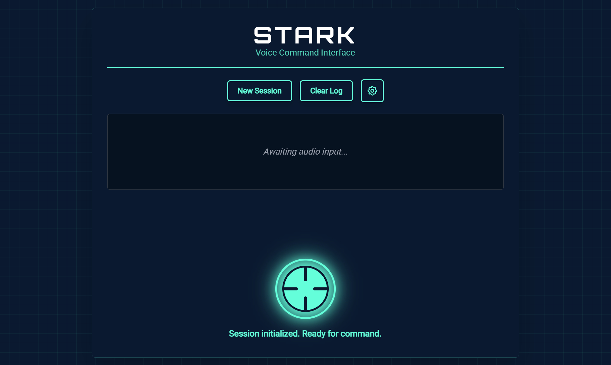
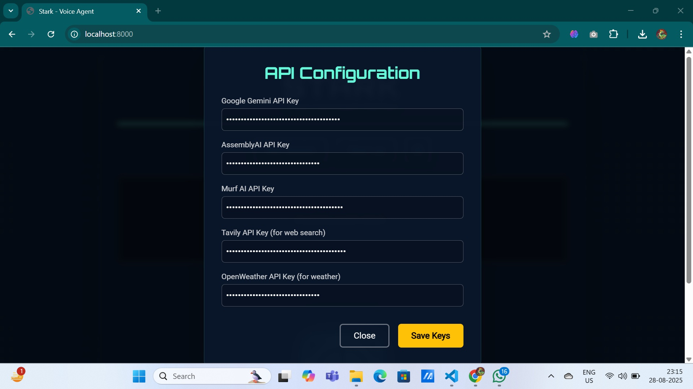
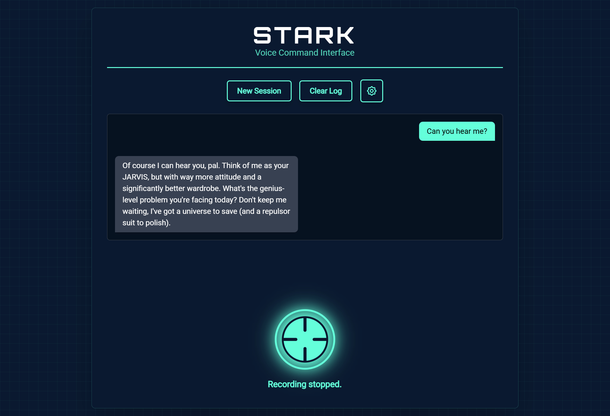

# STARK - Voice Agent

A sophisticated real-time voice-to-voice conversational AI system with a Tony Stark-inspired interface. This application combines speech recognition, AI conversation, text-to-speech, and web search capabilities to create an interactive voice assistant.

## Screenshots

<!-- Add your screenshots here to showcase the application -->

### Main Interface


*The Arc Reactor-styled voice control interface with real-time audio visualization*

### Settings Modal


*API key configuration modal for secure credential management*

### Chat Interface


*Real-time conversation display with Tony Stark personality responses*

---

## Features

- **Real-time Voice Conversation**: Stream audio input and receive AI-generated voice responses
- **Tony Stark Persona**: AI assistant with Tony Stark's personality - witty, intelligent, and charismatic
- **Web Search Integration**: Real-time web search capabilities for current information
- **Weather Information**: Get current weather data for any location
- **Modern UI**: Sleek, Iron Man-inspired interface with Arc Reactor design
- **Session Management**: Maintain conversation history across sessions
- **Real-time Audio Visualization**: Visual feedback during voice interactions

## Architecture

The system uses:

- **FastAPI** backend with WebSocket support for real-time communication
- **Google Gemini** for AI conversation and function calling
- **AssemblyAI** for speech-to-text transcription
- **Murf AI** for text-to-speech synthesis
- **Tavily API** for web search functionality
- **OpenWeatherMap** for weather data

## Prerequisites

- Python 3.8 or higher
- Modern web browser with microphone support
- API keys for the following services (see Setup section)

## Required API Keys

You'll need to obtain API keys from these services:

### Required (Essential for basic functionality)

1. **Google Gemini API Key**
   - Visit: [Google AI Studio](https://aistudio.google.com/)
   - Create a new project and generate an API key
   - Used for: AI conversation and function calling

2. **AssemblyAI API Key**
   - Visit: [AssemblyAI](https://www.assemblyai.com/)
   - Sign up and get your API key from the dashboard
   - Used for: Real-time speech-to-text transcription

3. **Murf AI API Key**
   - Visit: [Murf AI](https://murf.ai/)
   - Sign up for their API service
   - Used for: Text-to-speech voice synthesis

### Optional (For enhanced features)

1. **Tavily API Key**
   - Visit: [Tavily](https://tavily.com/)
   - Sign up for web search API access
   - Used for: Real-time web search functionality

2. **OpenWeatherMap API Key**
   - Visit: [OpenWeatherMap](https://openweathermap.org/api)
   - Create a free account and generate an API key
   - Used for: Weather information queries

## Installation

1. **Clone the repository:**

```bash
git clone <[repository-url](https://github.com/WizOctavius/stark-voice-agent)>
cd stark-voice-agent
```

**Install dependencies:**

```bash
pip install -r requirements.txt
```

**Add the HTML file:**

- Save the provided `index.html` in the `templates/` directory

**Add the JavaScript file:**

- Save the provided `script.js` in the `static/` directory

## Configuration

### Method 1: Environment Variables (Optional)

Create a `.env` file in the project root:

```env
MURF_API_KEY=your_murf_api_key_here
ASSEMBLYAI_API_KEY=your_assemblyai_api_key_here
GEMINI_API_KEY=your_gemini_api_key_here
TAVILY_API_KEY=your_tavily_api_key_here
OPENWEATHER_API_KEY=your_openweather_api_key_here
```

### Method 2: Web Interface (Recommended)

The application includes a settings modal where users can enter their API keys directly through the web interface. This method is more secure and user-friendly.

## Running the Application

**Start the server:**

```bash
python main.py
```

Or with uvicorn directly:

```bash
uvicorn main:app --host 0.0.0.0 --port 8000
```

**Open your web browser and navigate to:**

```bash
http://localhost:8000
```

1. **Configure API Keys:**
   - Click the settings button (gear icon) in the top-right
   - Enter your API keys in the modal that appears
   - Click "Save Keys"

2. **Start Conversing:**
   - Click the Arc Reactor button to start recording
   - Speak your question or command
   - Click again to stop recording and receive a response

## Usage

### Basic Voice Interaction

1. Click the central Arc Reactor button to start recording
2. Speak your message clearly
3. Click the button again to stop recording
4. Wait for the AI to process and respond with both text and voice

### Special Capabilities

The AI assistant can:

- Answer general knowledge questions with Tony Stark's personality
- Search the web for current information when asked about recent events
- Provide weather information for any location
- Give contextual nicknames based on your questions
- Maintain conversation context throughout the session

### UI Controls

- **New Session**: Start a fresh conversation
- **Clear Log**: Clear the chat history display
- **Settings**: Configure API keys
- **Voice Visualizer**: Shows audio input levels during recording

## Project Structure

```bash
stark-voice-agent/
├── main.py              # FastAPI backend server
├── requirements.txt     # Python dependencies
├── .env                # Environment variables (optional)
├── templates/
│   └── index.html      # Web interface
└── static/
    └── script.js       # Frontend JavaScript
```

## Key Components

### Backend (main.py)

- **WebSocket endpoint** (`/ws/{session_id}`): Handles real-time audio streaming
- **Tool functions**: Web search and weather lookup with API key parameters
- **LLM streaming**: Processes user input through Gemini with function calling
- **Audio processing**: Integrates with Murf AI for voice synthesis

### Frontend (script.js)

- **Audio capture**: Records and streams microphone input
- **WebSocket client**: Communicates with backend in real-time
- **Audio playback**: Plays received voice responses
- **UI management**: Handles button states and chat history

### Interface (index.html)

- **Tony Stark themed design**: Arc Reactor interface with HUD styling
- **Responsive layout**: Works on desktop and mobile devices
- **Modal system**: For API key configuration
- **Audio visualization**: Real-time frequency visualization

## Troubleshooting

### Common Issues

1. **"API Keys required" message**
   - Ensure you've entered all required API keys in the settings modal
   - Check that your API keys are valid and have sufficient credits/quota

2. **Microphone not working**
   - Grant microphone permissions when prompted by your browser
   - Ensure your microphone is not being used by other applications

3. **No audio playback**
   - Check your browser's audio settings
   - Ensure the page has permission to play audio

4. **WebSocket connection fails**
   - Verify the server is running on the correct port
   - Check for any firewall blocking localhost connections

5. **Poor speech recognition**
   - Speak clearly and at a moderate pace
   - Ensure you're in a quiet environment
   - Check your microphone quality and positioning

### API Limits

- Most APIs have rate limits and usage quotas
- Monitor your usage through respective service dashboards
- Consider upgrading plans for heavy usage

## Security Notes

- API keys entered through the web interface are stored in browser localStorage
- For production deployment, consider implementing proper authentication
- Never commit actual API keys to version control

## Contributing

Feel free to submit issues, fork the repository, and create pull requests for any improvements.

## License

This project is open source. Please check individual API service terms for their usage requirements.
